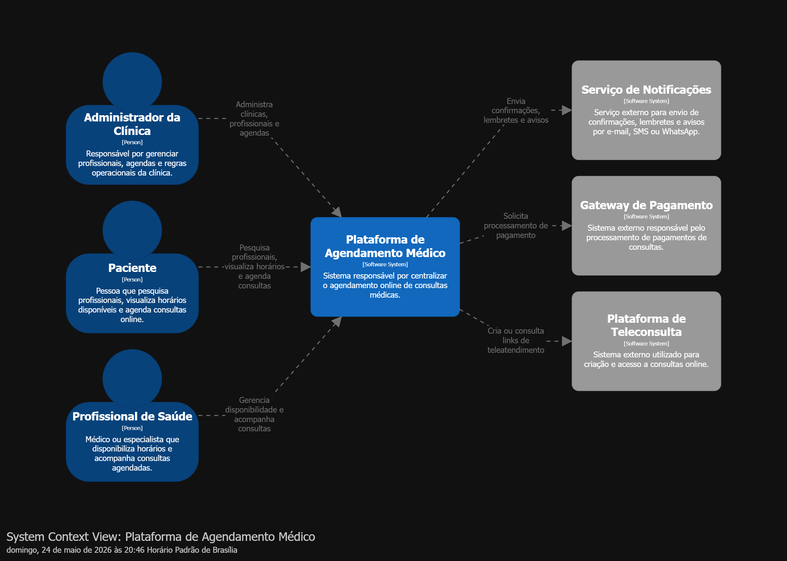
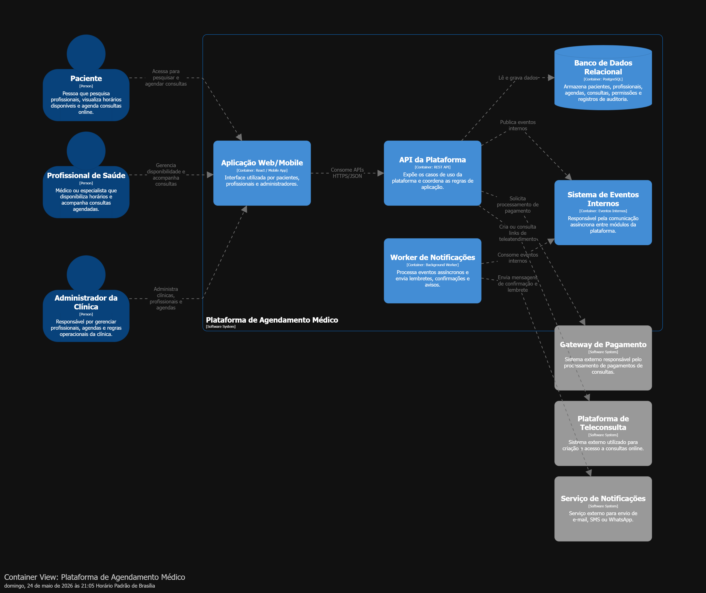
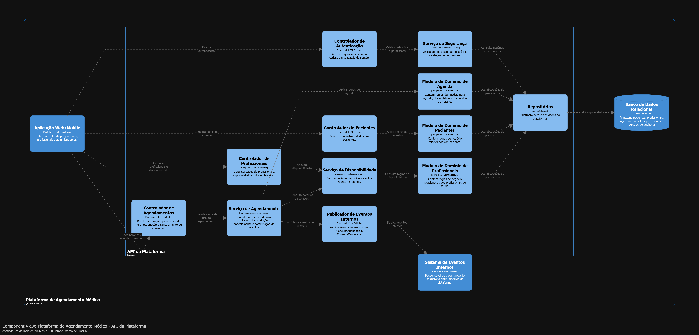

# Plataforma de Agendamento Médico - Arquitetura C4

Este repositório contém o trabalho da pós-graduação em Arquitetura de Software pela Infnet, desenvolvido para a disciplina de Fundamentos de Design de Sistemas e Modelo C4.

O objetivo do trabalho é atuar explicitamente no papel de Arquiteto de Software, projetando e documentando a arquitetura de uma Plataforma de Agendamento Médico. A proposta vai além da criação de diagramas: busca demonstrar clareza arquitetural, capacidade de decisão, entendimento dos impactos técnicos e habilidade de comunicação com diferentes públicos.

## Escopo da tarefa

A tarefa consiste em projetar e documentar a arquitetura de um sistema, contemplando:

- Definição do contexto do sistema e seus drivers de negócio.
- Identificação e priorização de atributos de qualidade.
- Registro de decisões arquiteturais relevantes.
- Seleção e justificativa de estilos e padrões arquiteturais.
- Projeto da estrutura do sistema.
- Comunicação da arquitetura utilizando o Modelo C4.

## Sistema proposto

A Plataforma de Agendamento Médico centraliza a jornada de agendamento de consultas, permitindo que pacientes pesquisem profissionais, visualizem horários disponíveis e realizem agendamentos online. Profissionais de saúde podem gerenciar sua disponibilidade e acompanhar consultas, enquanto administradores da clínica mantêm profissionais, agendas e regras operacionais.

O sistema também se integra a serviços externos de notificação, pagamento e teleconsulta.

## Drivers de negócio

- Reduzir atrito no agendamento de consultas.
- Diminuir trabalho manual da administração da clínica.
- Melhorar a visibilidade de disponibilidade dos profissionais.
- Reduzir faltas por meio de confirmações e lembretes.
- Permitir evolução gradual do produto sem aumentar excessivamente a complexidade operacional.

## Atributos de qualidade priorizados

- **Manutenibilidade:** separação clara entre domínio, aplicação, interfaces e infraestrutura.
- **Modificabilidade:** organização modular para evoluir funcionalidades sem acoplamento excessivo.
- **Confiabilidade:** uso de eventos internos para fluxos assíncronos, como notificações.
- **Segurança e privacidade:** autenticação, autorização, controle de permissões e registros de auditoria.
- **Escalabilidade evolutiva:** arquitetura preparada para crescimento gradual, evitando distribuição prematura.
- **Observabilidade:** decisões voltadas à rastreabilidade de operações relevantes, especialmente agendamentos, pagamentos e notificações.

## Decisões arquiteturais

As principais decisões foram registradas em ADRs:

- [ADR 001 - Adotar monolito modular](docs/adr/adr-001-adotar-monolito-modular.md)
- [ADR 002 - Clean Architecture](docs/adr/adr-002-clean-architecture.md)
- [ADR 003 - Eventos de domínio](docs/adr/adr-003-eventos-dominio.md)
- [ADR 004 - APIs e versionamento](docs/adr/adr-004-apis-versionamento.md)
- [ADR 005 - Segurança, privacidade e auditoria](docs/adr/adr-005-seguranca-privacidade-auditoria.md)

## Estilos e padrões arquiteturais

A arquitetura utiliza um **monolito modular** como estilo principal, adequado para preservar simplicidade operacional enquanto o domínio ainda pode evoluir dentro de limites bem definidos.

Dentro da API, a organização segue princípios de **Clean Architecture**, separando controladores, serviços de aplicação, módulos de domínio, repositórios e publicação de eventos. Para fluxos que não precisam ser executados de forma síncrona, como envio de notificações, a arquitetura utiliza **eventos internos** e processamento por worker.

Também foram considerados padrões como:

- REST API para comunicação entre aplicação cliente e backend.
- Repository para abstrair persistência.
- Application Services para coordenar casos de uso.
- Domain Modules para concentrar regras de negócio.
- Event Publisher e Background Worker para comunicação assíncrona.

## Estrutura projetada

Em alto nível, a solução é composta por:

- Aplicação Web/Mobile para pacientes, profissionais e administradores.
- API da Plataforma, responsável pelos casos de uso e regras de aplicação.
- Banco de Dados Relacional para dados transacionais e auditoria.
- Sistema de Eventos Internos para comunicação assíncrona.
- Worker de Notificações para envio de confirmações, lembretes e avisos.
- Integrações externas com notificações, pagamentos e teleconsulta.

## Diagramas C4

Os diagramas foram feitos utilizando o Modelo C4 e estão disponíveis como imagens renderizadas, além dos respectivos arquivos `.dsl`.

### C1 - Contexto

Mostra os usuários principais, o sistema em foco e os sistemas externos com os quais a plataforma se relaciona.

[Arquivo DSL](docs/c4/c1-context/context.dsl)



### C2 - Contêineres

Detalha os principais contêineres da plataforma, incluindo aplicação cliente, API, banco de dados, eventos internos e worker de notificações.

[Arquivo DSL](docs/c4/c2-container/container.dsl)



### C3 - Componentes da API

Apresenta os componentes internos da API da Plataforma, evidenciando controladores, serviços de aplicação, módulos de domínio, repositórios e publicador de eventos.

[Arquivo DSL](docs/c4/c3-components/components.dsl)



## Organização do repositório

```text
docs/
  adr/
    adr-001-adotar-monolito-modular.md
    adr-002-clean-architecture.md
    adr-003-eventos-dominio.md
    adr-004-apis-versionamento.md
    adr-005-seguranca-privacidade-auditoria.md
  c4/
    c1-context/
      context.dsl
      C1_Contexto-dark.png
    c2-container/
      container.dsl
      C2_Conteineres-dark.png
    c3-components/
      components.dsl
      C3_Componentes_API-dark.png
```

